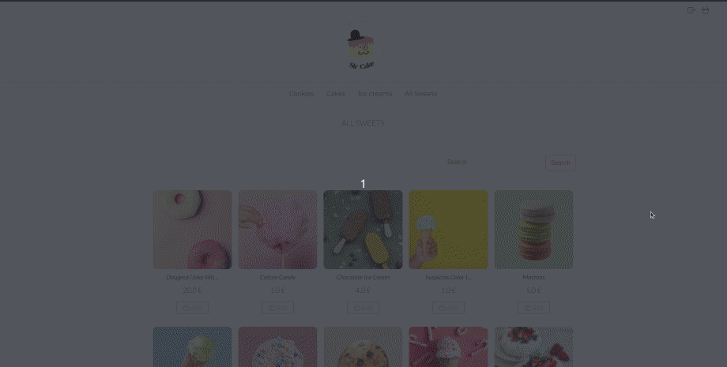

# sir-cake

Sir cake is an e-commerce web application. Users with the default access (customers) can register, search for items and buy them. Users with special access (sellers) can add and edit products, review and ship orders, see PDF invoices, and have an overview of different sales statistics.

Sir cake is a Django application written in Python 3 and developed on Ubuntu.

## Features:
- Landing page. 
- Register, log in, and log out pages. Users don't necessarily need to register/log in to buy items and can also shop anonymously.
- Store where all items are displayed. Users can sort products by categories or search among them with a simple text search. It's also possible to add items directly to the basket. 

- Detail page that displays only one item. Users have the option to add N-numbers of the item into the basket.
- Shopping bag page, where users can change the number of items in their bag or delete them.
- Two-step payment process. Users have to enter their shipping and payment information.

After adding the first item to the shopping bag, users have 30 minutes to finish their purchase. During this period, chosen items are reserved, meaning other users can't buy them. After 30 minutes, the basket expires, and products are no longer reserved.  

The other part of the application is meant for sellers of e-commerce and isn't available for users with default access. Sellers can, besides already described pages:
- See the inventory of items, search among them, and edit or delete them.
- Review orders, sort them by status, and mark orders as shipped. Sellers can also see all order information (items bought and users' data) or open a pdf invoice.

- Have an overview of various business-related information. Data about: the current value of the inventory, number of store visitors, sales statistics, best seller items, etc., are displayed with graphs and tables. 

## Database schema:

## Technologies:
- Django ORM
- Django signals
- Django context processors
- Django class-based views
- Django messages
- Django auth
- Django sessions
- Crispy forms
- Pillow image library
- Javascript
- Chart.Js framework
- xhtml2pdf framework
- Django-cron library

## Future work:
- Reset password functionality
- Add unit tests
- Better responsiveness
- Use external payment service

